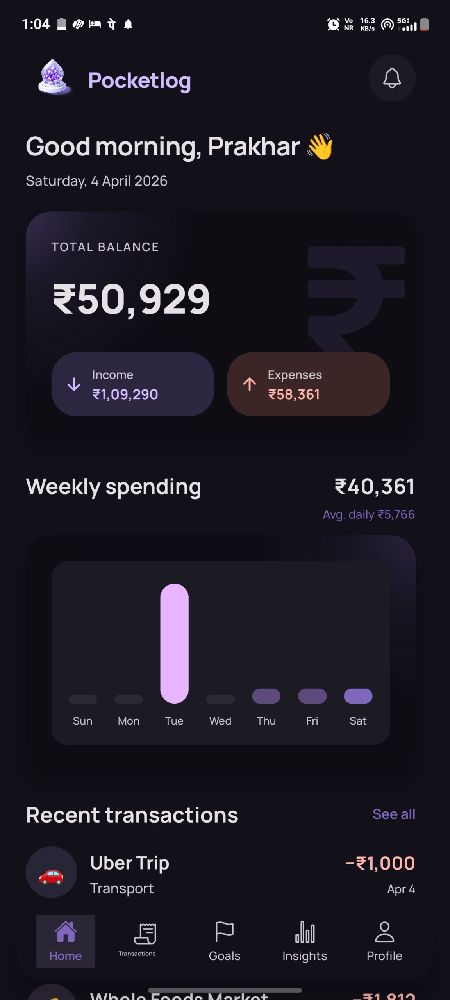
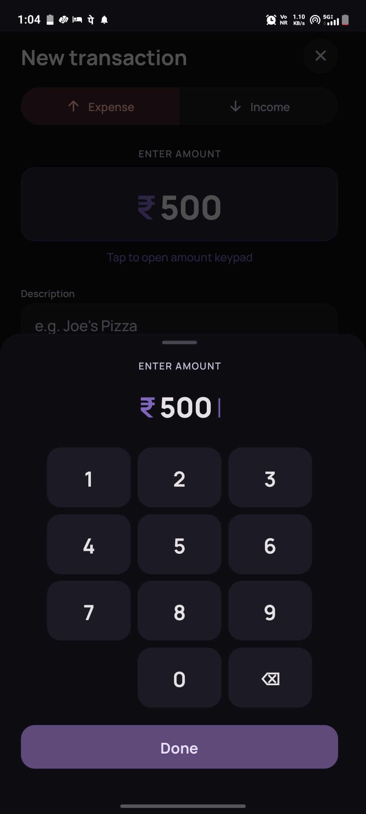
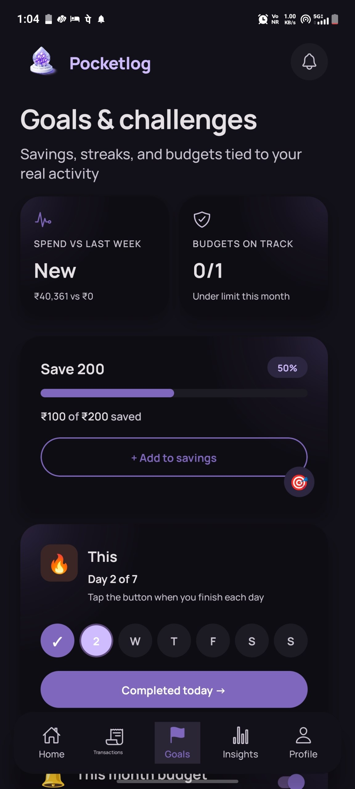
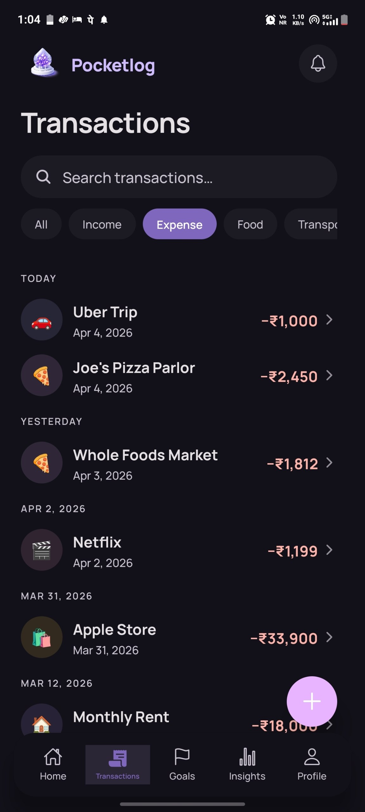
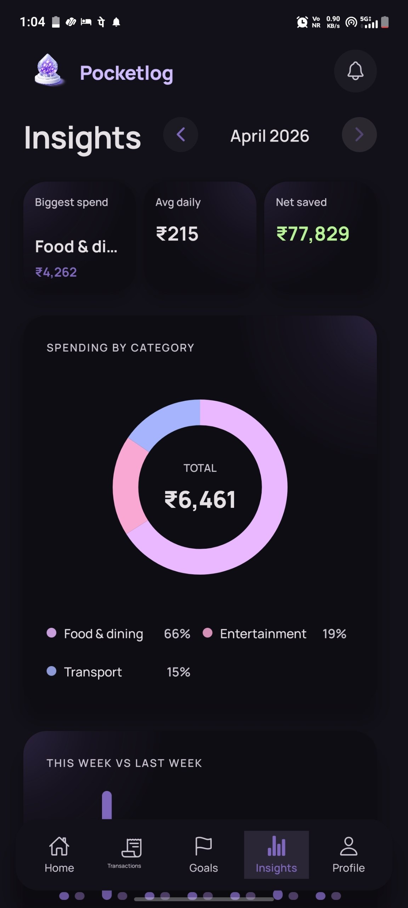

# Pocketlog

<p align="center">
  
</p>

<p align="center">
  <strong>Personal finance companion</strong> — track spending, see patterns, set light goals, and stay oriented on your phone.<br />
  Built with <strong>React Native (Expo)</strong> for the mobile app development assignment: structured UX, local-first data, and polish over feature sprawl.
</p>

<p align="center">
  <a href="https://github.com/prakhar1304">@prakhar1304</a>
</p>

---

## Demo video

Screen recording walkthrough (download or open locally):

**[`appUI/demoVideo.mp4`](./appUI/demoVideo.mp4)**

> On GitHub: open the file in the repo or use *View raw* to play/download.

---

## Screenshots

| Home & balance | Transactions | Goals |
|:---:|:---:|:---:|
|  |  |  |

| Insights | Profile |
|:---:|:---:|
|  |  |

*If your captures map to different tabs, swap image filenames in `appUI/` or update the table above.*

---

## How this maps to the assignment

| Requirement | Pocketlog implementation |
|-------------|-------------------------|
| **Home dashboard** | Balance, income, expenses (`BalanceHeroCard`), 7-day **weekly spending** chart, recent transactions with empty state. |
| **Transaction tracking** | Add / **edit** (`/add-transaction`, optional `id`), **delete** (row actions / long-press + confirm), **search** + **filter chips** (all / income / expense), grouped history by date. |
| **Goal or challenge** | **Goals** tab: savings targets (with **add-to-savings**), **streaks** (manual advance or **auto from daily logs**), **budget** per category with spend vs limit and alert toggle. Stats tie to real transactions. |
| **Insights** | Month picker, **spending by category** (donut), **this week vs last week**, stat row (biggest category, avg daily, net saved), top transactions. |
| **Mobile UX** | Custom tab bar, safe areas, haptics, dialogs, onboarding + profile setup, empty / no-results states, keyboard-friendly forms. |
| **Data** | **AsyncStorage** + **Zustand** (`persist`) for transactions, goals, and app settings. Optional seed data for first-run transactions. |
| **Structure** | `app/` (Expo Router screens), `src/components`, `src/store`, `src/utils` — UI separated from stats/CSV/export helpers. |

---

## Optional enhancements included

- **Dark / light** theme (Profile → Theme)
- **CSV export** (Profile)
- **Haptic** feedback on key actions
- **Animated** balance on home (`useAnimatedNumber`)
- **Offline-first** (no network required for core flows)

---

## Tech stack

- **Expo SDK 54** · **expo-router** · **TypeScript**
- **Zustand** + **AsyncStorage** persistence
- **date-fns** for dates · **react-native-svg** for charts

---

## Getting started

```bash
git clone https://github.com/prakhar1304/pocketlog.git
cd pocketlog
npm install
npx expo start
```

Then press **`w`** (web), **`a`** (Android), or **`i`** (iOS simulator), or scan the QR code with **Expo Go**.

### Checks

```bash
npm run typecheck   # tsc --noEmit
npx expo lint
```

---

## Assumptions (documented)

- **Currency:** UI copy uses **₹**; amounts are stored as whole numbers (rupees).
- **Single device:** Data stays on device unless user exports CSV; no cloud sync.
- **Email / name:** Collected at onboarding for a personal profile only (assignment-style flow).
- **Not a bank:** No account linking, payments, or real financial institution APIs.

---

## Project layout (high level)

```
app/
  (tabs)/          # Home, Transactions, Goals, Insights, Profile
  onboarding.tsx
  onboarding-profile.tsx
  add-transaction.tsx
  index.tsx        # Entry + routing guard
src/
  components/      # Feature + UI building blocks
  store/           # Zustand stores
  utils/           # Stats, CSV, filters, insights
  constants/       # Theme tokens
appUI/             # README screenshots + demo MP4 (see appUI/README.md)
```

More visual/design context: **`DESIGN.md`**.

---

## Author

**GitHub:** [github.com/prakhar1304](https://github.com/prakhar1304)

Repository URL (adjust if your fork name differs): `https://github.com/prakhar1304/pocketlog`
